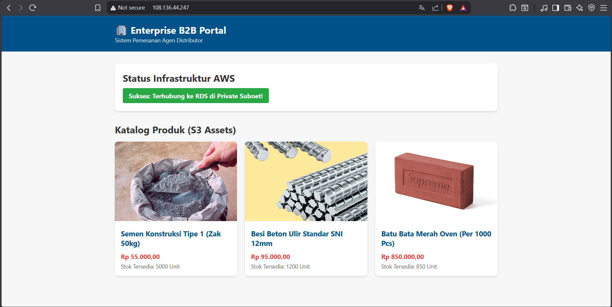

# 🏢 Enterprise B2B Wholesale Portal - AWS 3-Tier Architecture

Repositori ini berisi *Proof of Concept* (PoC) implementasi portal B2B Wholesale yang dibangun menggunakan konsep **3-Tier Architecture** di Amazon Web Services (AWS). Proyek ini merancang pemisahan antara area komputasi publik, database privat, dan penyimpanan objek statis untuk mencapai standar keamanan dan skalabilitas tingkat korporat.

## 🚀 Bukti Konsep (Proof of Concept)

*Tangkapan layar di atas menunjukkan aplikasi Web (EC2) berhasil merender UI, menarik gambar statis dari Amazon S3, dan berhasil menembus Private Subnet untuk berkomunikasi dengan Amazon RDS MySQL secara aman.*

## Topologi Infrastruktur
1. **Penyimpanan Statis (Storage):** Katalog gambar produk dilayani secara independen oleh **Amazon S3**.
2. **Server Aplikasi (Compute):** Menjalankan Web Server (Apache/PHP) di dalam **Amazon EC2** yang diletakkan pada *Public Subnet*.
3. **Penyimpanan Data (Database):** Data katalog terstruktur disimpan di **Amazon RDS (MySQL)** yang diisolasi ketat di dalam *Private Subnet* tanpa akses internet publik.

## Struktur Repositori & Dokumentasi (Architectural Records)
Proyek ini dilengkapi dengan dokumentasi teknis mendalam yang merefleksikan standar pelaporan rekayasa perangkat lunak korporat:
- [001 - Latar Belakang & Masalah Bisnis](docs/001-business-problem.md)
- [002 - Solusi Arsitektur 3-Tier](docs/002-architecture-solution.md)
- [003 - Justifikasi Layanan (ADR: EC2 vs ECS, RDS vs DynamoDB)](docs/003-services-justification.md)
- [004 - Log Post-Mortem & Troubleshooting (Penyelesaian Insiden)](docs/004-post-mortem-troubleshooting.md)
- [005 - Monitoring, Alarms & Disaster Recovery (CloudWatch, SNS, AMI)](docs/005-monitoring-disaster-recovery.md)

## Teknologi yang Digunakan
- **Cloud Provider:** Amazon Web Services (VPC, IGW, EC2, S3, RDS, Security Groups)
- **Backend:** PHP 8.2 & MySQL
- **Frontend:** HTML5, CSS3, Vanilla JavaScript
- **Automation:** Bash Scripting (via EC2 User Data)

## Cara Deploy (Berdasarkan Praktik Immutable Infrastructure)
Semua konfigurasi komputasi telah diotomatisasi. Untuk melakukan *deployment* di lingkungan AWS:
1. Konfigurasikan VPC, Public Subnet, dan Private Subnet.
2. Konfigurasikan Security Group (Web-SG untuk publik, DB-SG khusus untuk Web-SG).
3. Buat Amazon RDS di Private Subnet dan S3 Bucket (Public Read) untuk gambar.
4. Perbarui endpoint di `app/api/config.php` dan link gambar S3 di `app/api/get_products.php`.
5. Luncurkan EC2 baru menggunakan script otomatisasi `scripts/ec2-provisioning.sh` pada kolom User Data.

---
*Dibuat untuk mendemonstrasikan kapabilitas Cloud Engineering & Arsitektur Skala Enterprise.*